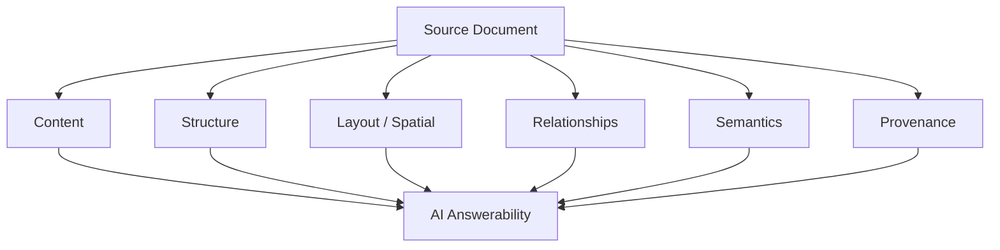
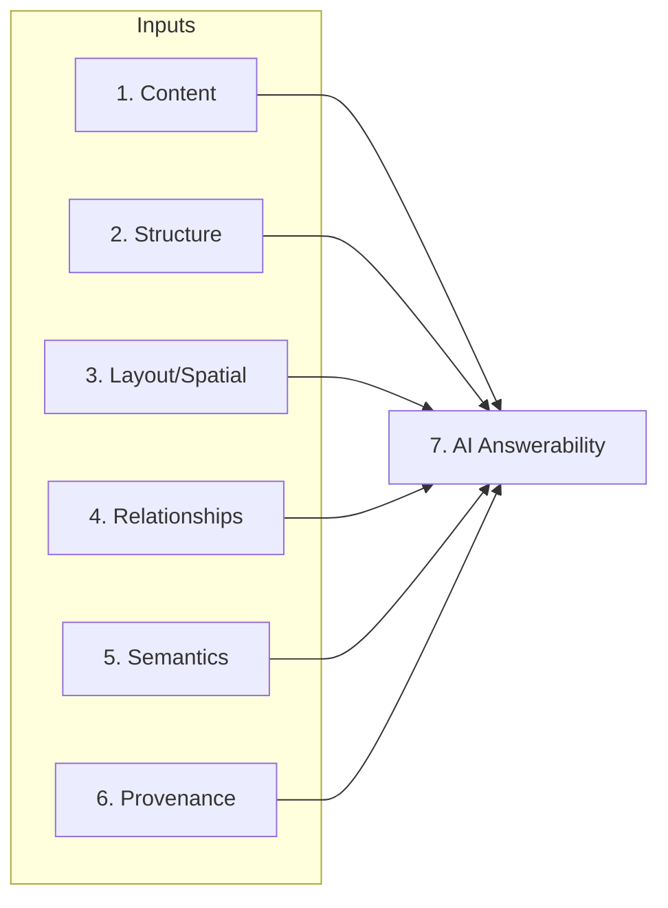
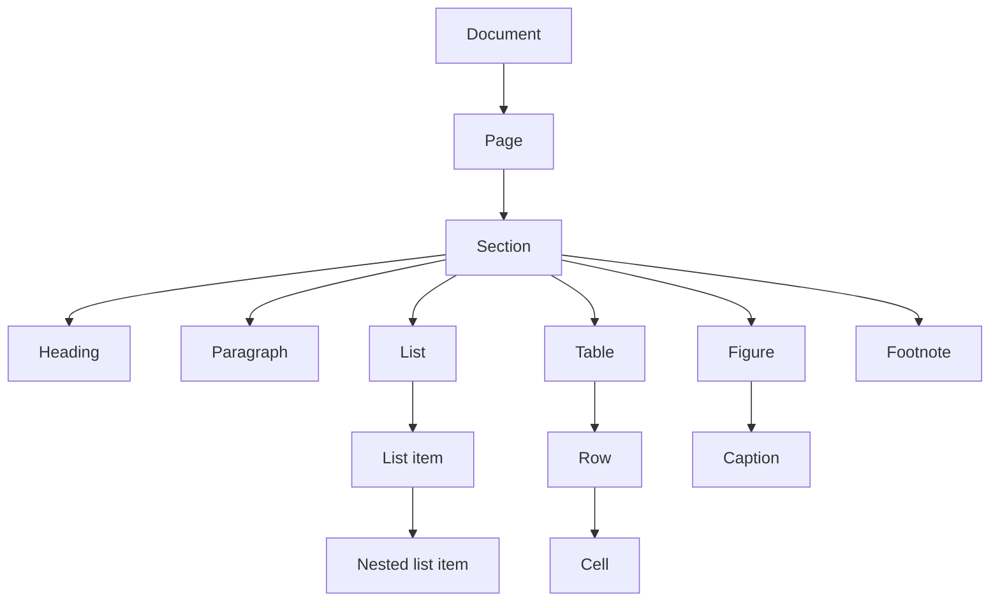
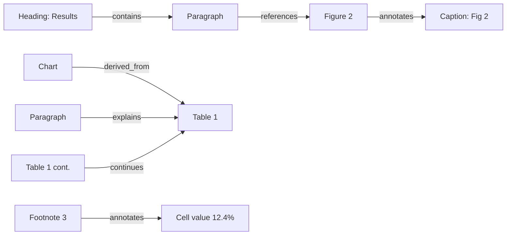
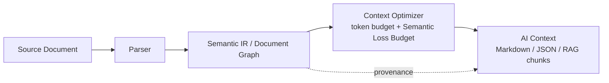

# ContextForge — Document Fidelity Model (Milestone 1A)

> **Reading contract.** This document is the canonical reference for the
> ContextForge project. Future implementation decisions must be traceable back
> to it. It deliberately distinguishes **established facts**, **project
> hypotheses**, and **future validation work**. It makes **no** claim that
> ContextForge is better than any existing system, because no benchmark exists
> yet to support such a claim.

**Label legend**

| Label | Meaning |
|-------|---------|
| `[FACT]` | Established and, where about third-party systems, backed by a primary source cited in Section 14. |
| `[HYP]` | A ContextForge working hypothesis. Believed, not proven. Belongs to validation in 1B/1C. |
| `[OPEN]` | An unresolved design or research question. |

---

## Table of contents

1. [Executive Summary](#section-1--executive-summary)
2. [Definition of Document Fidelity](#section-2--definition-of-document-fidelity)
3. [The Seven Fidelity Dimensions](#section-3--the-seven-fidelity-dimensions)
4. [Content Fidelity](#section-4--content-fidelity)
5. [Structural Fidelity](#section-5--structural-fidelity)
6. [Layout / Spatial Fidelity](#section-6--layout--spatial-fidelity)
7. [Relationship Fidelity](#section-7--relationship-fidelity)
8. [Semantic Fidelity](#section-8--semantic-fidelity)
9. [Provenance Fidelity](#section-9--provenance-fidelity)
10. [AI Answerability](#section-10--ai-answerability)
11. [Fidelity vs Token Efficiency](#section-11--fidelity-vs-token-efficiency)
12. [Document Fidelity Score (PROPOSED / NOT FINAL)](#section-12--document-fidelity-score-proposed--not-final)
13. [Adversarial Document Patterns](#section-13--adversarial-document-patterns)
14. [Competitive Baseline](#section-14--competitive-baseline)
15. [What ContextForge Must NOT Assume](#section-15--what-contextforge-must-not-assume)
16. [Working Product Thesis](#section-16--working-product-thesis)
17. [Hypotheses to Validate in 1B / 1C](#section-17--hypotheses-to-validate-in-1b--1c)
18. [Milestone 1A Exit Criteria](#section-18--milestone-1a-exit-criteria)
19. [Open Questions](#section-19--open-questions)

---

## Section 1 — Executive Summary

### 1.1 The problem

Modern AI systems increasingly consume documents — PDFs, Word files, Excel
workbooks, presentations, scanned images — by first converting them to text or
Markdown and then feeding that text to a language model or a retrieval system.
This conversion step is where information can be silently lost.

Loss is most acute when the source contains structure that plain running text
cannot express: complex and merged-cell tables, multi-page tables, financial
data with totals and units, charts and diagrams, captions, footnotes,
multi-column layouts, repeated headers/footers, cross-references, formulas, and
spatial or semantic relationships between elements.

### 1.2 Why document → Markdown can be lossy

`[FACT]` Markdown is a **linear, presentation-oriented** format. It can encode
headings, lists, links, and simple pipe tables, but it has no native way to
express: a cell that spans multiple columns; a table that continues across a
page break; the fact that a caption belongs to a specific figure; the fact that
a chart is a visualization of a specific underlying table; that "20%" in one row
is a *rate* while the number beside it is a *count*; or where on which page a
value came from.

`[FACT]` Because Markdown flattens two-dimensional, hierarchical, and relational
information into a one-dimensional token stream, some information present in the
source has no place to go. Whether that lost information *matters* depends on the
downstream question — which is the crux of this project.

### 1.3 Extraction quality ≠ AI-context quality

`[HYP]` **Document extraction quality** (did we recover the right characters,
tables, and reading order?) and **AI-context quality** (can a model correctly
reason about the document from the representation we produced?) are related but
distinct. A representation can be a faithful *transcription* and still be a poor
*context*, if it drops the relationships and provenance a model needs to answer
non-trivial questions — or, conversely, if it is so verbose that the relevant
facts are diluted beyond a usable token budget.

`[FACT]` Existing extraction systems are strong and improving (Section 14).
ContextForge does **not** assume they are weak at extraction. The open question
is about the *representation for downstream reasoning*, not about raw extraction.

### 1.4 What Milestone 1A establishes

Milestone 1A produces a **shared, testable vocabulary** for the project:

- a formal definition of document fidelity for AI context;
- seven fidelity dimensions, each with measurable indicators;
- a conceptual Semantic Document Graph;
- a catalog of adversarial document patterns;
- an evidence-labeled competitive baseline;
- explicit hypotheses and exit criteria for later milestones.

It does **not** build a parser, run a benchmark, or rank systems.

### 1.5 Hypothesis vs fact, up front

- `[FACT]` Markdown cannot natively express many structural, spatial,
  relational, and provenance features of complex documents.
- `[FACT]` Leading extractors already provide reading order, table structure,
  bounding boxes, and multiple output formats (Section 14).
- `[HYP]` For AI reasoning, *relationships + semantics + provenance + a token
  budget* are undervalued by extraction-similarity metrics and are a meaningful
  source of usable differentiation.
- `[OPEN]` Whether ContextForge can measurably improve downstream answerability
  under a fixed token budget, relative to strong baselines, on representative
  document classes.

---

## Section 2 — Definition of Document Fidelity

### 2.1 Formal definition

> **Document Fidelity** is the degree to which an extracted / normalized
> representation preserves the information from the source document that is
> necessary for correct **reconstruction**, **interpretation**, **verification**,
> and **downstream AI reasoning**.

Refinement: fidelity is **not** a single scalar and is **not** absolute. It is
defined *relative to a set of intended uses*. A representation that is
high-fidelity for "reconstruct the visual page" may be low-fidelity for "answer
a numerical question about the third table," and vice versa. `[HYP]` Therefore
fidelity must be decomposed into dimensions and measured against tasks, not
against a single reference string.

### 2.2 Seven aspects, distinguished

| Aspect | Question it answers |
|--------|---------------------|
| **Syntactic fidelity** | Are the exact characters, numbers, and symbols preserved? |
| **Structural fidelity** | Is the document's logical hierarchy (sections, lists, tables) preserved? |
| **Spatial fidelity** | Is the physical/positional layout and correct reading order preserved? |
| **Semantic fidelity** | Is the *meaning* — units, roles, types, quantities — preserved, not just the glyphs? |
| **Relationship fidelity** | Are the links *between* elements (figure↔caption, chart↔table) preserved? |
| **Provenance fidelity** | Can each piece of output be traced back to an exact source location? |
| **AI answerability** | Can a model correctly answer questions about the source using only the representation? |

These map onto the seven operational dimensions in Section 3. AI answerability
is treated both as its own dimension and as an *outcome measure* that the other
six feed into.

### 2.3 Why Markdown similarity alone is insufficient

`[HYP]` A high textual similarity between a system's Markdown and a reference
Markdown demonstrates transcription overlap but does **not** demonstrate that:

- table cells are associated with the correct row/column headers;
- a footnote is bound to the value it annotates;
- "20%" is understood as a rate rather than a count;
- the answer to "what page is the revenue figure on?" is recoverable.

`[FACT]` Two representations with near-identical Markdown similarity scores can
differ arbitrarily on all of the above, because Markdown similarity is blind to
relationships, semantics, and provenance. `[HYP]` An **answerability-based**
evaluation (Section 10) can expose these differences; similarity metrics
structurally cannot.

---

## Section 3 — The Seven Fidelity Dimensions

The following dimensions are the project's working decomposition of fidelity.
Each is treated rigorously in Sections 4–10; this section is the at-a-glance
matrix.

For **each** dimension below: formal definition, included/excluded, a correct
example, a failure example, why it matters for AI, measurable indicators, a
possible benchmark method, difficulty, and classification (table stakes /
differentiator candidate / validation required).

### 3.1 Dimension summary matrix

| # | Dimension | Core question | Classification (working) | Difficulty |
|---|-----------|---------------|--------------------------|-----------|
| 1 | Content | Right characters/numbers/symbols? | Table stakes | Low–Med |
| 2 | Structure | Right logical hierarchy? | Table stakes → differentiator at the hard tail | Med |
| 3 | Layout / Spatial | Right reading order & positions? | Mostly table stakes; adversarial cases are differentiator | Med–High |
| 4 | Relationships | Right links between elements? | **Differentiator candidate** | High |
| 5 | Semantics | Right meaning/units/roles? | **Differentiator candidate** | High |
| 6 | Provenance | Traceable to exact source? | Partial today → differentiator as a first-class layer | Med |
| 7 | AI Answerability | Can a model answer from it? | **Primary outcome metric** | High |

`[HYP]` The classification column is a hypothesis about where differentiation is
plausible, not a validated result. It must be tested in 1B/1C.

---

## Section 4 — Content Fidelity

### 4.1 Formal definition

**Content Fidelity** is the degree to which the atomic textual content of the
source — characters, numbers, punctuation, symbols, and inline formulas — is
recovered exactly (or with only intentional, reversible normalization).

### 4.2 Included

- Normal running text (words, sentences, paragraphs as character sequences).
- Numbers, including thousands separators, decimal marks, signs, and currency
  glyphs (`1,234.56`, `-3.2`, `€1.000,50`).
- Punctuation and typographic variants (straight vs curly quotes, en/em dashes,
  ligatures such as `fi`).
- Unicode correctness: accents, non-Latin scripts (CJK, Arabic, Cyrillic),
  combining characters, and normalization form (NFC/NFD).
- Symbols: `%`, `±`, `×`, `→`, mathematical operators, superscripts/subscripts.
- Inline formulas and equations (as text, LaTeX, or MathML — see 4.5).
- URLs and identifiers where present.
- Document metadata where relevant (title, author, creation date) — treated as
  content when it carries meaning, and as provenance when used for tracing.

### 4.3 Excluded

- The *arrangement* of content (that is Structure and Layout).
- The *meaning* of content beyond its characters (that is Semantics; `"20%"` as
  a rate is a Section 8 concern).
- Visual styling that does not change meaning (unless style *is* meaning, e.g. a
  strikethrough indicating a deleted clause).

### 4.4 Exact extraction, normalization, and their tension

`[FACT]` There is a real tension between **exact extraction** (byte-faithful) and
**normalization** (canonicalization for downstream use):

- **Whitespace**: PDFs often encode spacing via positioning rather than space
  characters; naive extraction can concatenate words or inject spurious spaces.
- **Encoding**: Custom font encodings without a proper CMAP can yield glyphs
  that cannot be mapped back to Unicode, producing garbled or empty text.
  `[FACT]` PyMuPDF documents this failure mode and recommends OCR fallback for
  such PDFs (Section 14).
- **Character substitutions**: ligature `fi` → `fi`, curly quotes → straight,
  soft hyphens at line breaks. These are *lossy-by-choice* and must be recorded
  as normalization, not silently applied.

`[HYP]` ContextForge should treat normalization as an **explicit, reversible,
recorded transformation**, so that provenance can still point at the original
glyphs. This is a design stance, not yet implemented.

### 4.5 Formulas and equations

`[FACT]` Some systems detect formulas as first-class objects (Docling advertises
formula understanding; Section 14). `[OPEN]` The right *representation* of a
formula for AI reasoning — Unicode, LaTeX, MathML, or a structured expression
tree — is unresolved and may be task-dependent.

### 4.6 Correct vs failure example

**Correct**

Source cell: `-1,234.5%`
Representation preserves: sign, thousands separator, decimal, and percent glyph
exactly; normalization (if any) recorded.

**Failure**

Source: `financial reconfiguration` → extracted as `nancial reconguration`
(dropped ligature glyphs) — a content-fidelity failure that also silently
corrupts search and semantics.

### 4.7 Why it matters for AI

`[FACT]` If the characters are wrong, everything downstream is wrong: a dropped
minus sign inverts a financial conclusion; a mis-mapped glyph breaks retrieval.
Content fidelity is the floor.

### 4.8 Measurable indicators

- Character error rate (CER) / word error rate (WER) vs ground truth.
- Numeric exactness rate (fraction of numeric tokens reproduced exactly,
  including sign and separators).
- Unicode normalization consistency.
- Symbol/percent preservation rate.

### 4.9 Possible benchmark methodology

Aligned string comparison against curated ground truth with separate scoring for
alphabetic text, numeric tokens, and symbols; a dedicated "hard glyph" subset
(ligatures, CJK, math) to avoid averaging away rare-but-critical failures.

### 4.10 Difficulty and classification

- **Difficulty**: Low–Medium for clean digital PDFs; Medium–High for scanned or
  custom-encoded documents (OCR-bound).
- **Classification**: **Table stakes.** `[HYP]` Content fidelity is *necessary
  but almost certainly not sufficient* as the project's primary differentiator —
  strong extractors already achieve high content fidelity on clean inputs, so
  competing on characters alone is unlikely to distinguish ContextForge.

---

## Section 5 — Structural Fidelity

### 5.1 Formal definition

**Structural Fidelity** is the degree to which the source's **logical
hierarchy** and element typing are preserved: which text is a heading vs a
paragraph, how sections nest, how lists nest, how tables decompose into
rows/cells, and how figures relate to their captions *as structure*.

### 5.2 The canonical hierarchy

### 5.3 Included

- **Heading levels** and the section tree they induce (H1 > H2 > H3 …).
- **Section membership**: which paragraphs, lists, tables, and figures belong to
  which section.
- **List hierarchy**: ordered/unordered, nesting depth, item boundaries.
- **Table hierarchy**: table → row → cell, plus header rows/columns and merged
  (spanning) cells as structural facts.
- **Figure/caption relationship** as a structural containment.
- **Logical vs physical structure**: the reading-logical tree, distinct from the
  page-physical arrangement (Section 6).

### 5.4 Excluded

- Absolute coordinates and reading-order resolution (Layout, Section 6).
- The *meaning* of a heading or the *semantics* of a cell value (Section 8).
- Non-structural typed relationships such as "this chart is derived from that
  table" (Relationships, Section 7).

### 5.5 Repeated page furniture (logical vs physical)

`[FACT]` Running headers, footers, page numbers, and watermarks are *physical*
artifacts that usually should **not** appear in the *logical* structure as body
content. `[FACT]` Systems differ in whether they suppress or duplicate this
furniture; MarkItDown's `<!-- page N -->` markers and Docling's page-aware model
are examples of explicit page handling (Section 14). Mishandling furniture
causes semantic duplication (Section 13, pattern 8).

### 5.6 Correct vs failure example

**Correct**: A three-level numbered outline is reproduced as a nested section
tree, with each paragraph attached to its deepest owning heading.

**Failure**: All headings are emitted as plain paragraphs of equal weight,
collapsing the outline; a downstream "summarize section 2.3" request can no
longer locate section 2.3.

### 5.7 Why it matters for AI

`[HYP]` Structure is what makes *scoping* possible ("in the Methods section…",
"the totals row…"). Without it, retrieval and section-scoped reasoning degrade to
whole-document guesswork.

### 5.8 Measurable indicators

- Heading-level accuracy (predicted vs true level).
- Tree edit distance between predicted and ground-truth structure trees.
- List nesting accuracy; table row/column/merge reconstruction accuracy.
- Furniture-classification precision/recall (is this a running header?).

### 5.9 Possible benchmark methodology

Ground-truth structure trees (e.g. derived from tagged PDFs, DocBook, or
hand-labeled corpora) compared via tree edit distance, with a separate merged-
cell and furniture subset.

### 5.10 Difficulty and classification

- **Difficulty**: Medium; the hard tail (merged headers, implicit sections,
  furniture) is Medium–High.
- **Classification**: **Table stakes** for common cases; `[HYP]` a
  **differentiator candidate** specifically on the hard tail (merged/nested table
  headers, furniture suppression, implicit sectioning).

---

## Section 6 — Layout / Spatial Fidelity

### 6.1 Formal definition

**Layout / Spatial Fidelity** is the degree to which the physical arrangement of
content on the page — positions, columns, proximity, alignment, and the correct
**reading order** derived from them — is preserved and correctly interpreted.

### 6.2 Included

- Multi-column layouts and correct column-wise reading order.
- Reading order across blocks, columns, and pages.
- Bounding boxes / coordinates for blocks, lines, words, cells, figures.
- Alignment and proximity as grouping cues.
- Page-to-page relationships (continuation, spillover).
- Text boxes, sidebars, callouts, pull quotes, and floating elements.
- Headers and footers as *positioned* furniture.
- Spatial grouping (which caption sits under which figure by position).

### 6.3 Excluded

- The *logical* tree independent of position (Structure, Section 5).
- The typed semantic link between spatially adjacent elements (Relationships,
  Section 7) — proximity is a *cue* for relationships, not the relationship
  itself.

### 6.4 Reading order can be extracted yet be semantically wrong

`[FACT]` Producing *a* reading order is standard; leading tools expose reading
order and multi-column handling (Docling advertises reading-order recovery;
PyMuPDF4LLM advertises multi-column support and natural reading order —
Section 14). `[HYP]` However, a technically-produced order can still be
*semantically* wrong: the tokens are all present and in *some* sequence, but the
sequence does not match how a human reads the meaning, which corrupts any
order-sensitive reasoning.

### 6.5 Three adversarial examples

1. **Two-column academic paper.** Naive top-to-bottom, left-to-right scanning
   interleaves the left and right columns line by line, producing zip-mixed
   sentences. The characters are all correct (content fidelity intact) but the
   reading order is destroyed.
2. **Newspaper with a mid-page pull quote.** A large floating pull quote sits
   between columns. A geometric sort may splice the pull quote into the middle of
   a sentence of body text.
3. **Invoice with a right-aligned totals sidebar.** A sidebar containing
   `Subtotal / Tax / Total` is spatially parallel to a line-item table. Row-major
   reading can weave sidebar labels between table rows, associating the wrong
   number with the wrong label.

`[FACT]` In all three, a plain character-similarity metric can score highly while
the usable meaning is scrambled — motivating spatial-aware evaluation and
Section 10 answerability testing.

### 6.6 Correct vs failure example

**Correct**: Two-column page emitted column-by-column, each column's paragraphs
contiguous, footnotes and pull quotes separated out and labeled by role.

**Failure**: Line-interleaved columns; footnote text injected mid-paragraph.

### 6.7 Why it matters for AI

`[HYP]` Order-sensitive tasks (following an argument, reading a numbered
procedure, associating a label with its value) fail when reading order is wrong,
even with perfect characters.

### 6.8 Measurable indicators

- Reading-order rank correlation (e.g. Kendall's τ) vs ground-truth order.
- Column-assignment accuracy.
- Bounding-box IoU for blocks/cells where coordinates are provided.
- Furniture/float separation accuracy.

### 6.9 Possible benchmark methodology

Hand-ordered ground-truth block sequences on a deliberately adversarial layout
corpus (multi-column, floats, sidebars, rotated pages), scored by order
correlation and by downstream order-sensitive questions.

### 6.10 Difficulty and classification

- **Difficulty**: Medium–High; adversarial layouts are High.
- **Classification**: Common cases are **table stakes**; `[HYP]` the adversarial
  tail is a **differentiator candidate** and requires benchmark validation.

---

## Section 7 — Relationship Fidelity

> This section is central to the ContextForge thesis.

### 7.1 Formal definition

**Relationship Fidelity** is the degree to which the **typed relationships
between document elements** are preserved — not merely that the elements exist,
but that the links connecting them (a caption *belongs to* a figure, a chart *is
derived from* a table, a footnote *annotates* a value) are represented and
recoverable.

### 7.2 Relationships of interest

- paragraph → figure (a paragraph *refers to* / *illustrated by* a figure)
- figure → caption (*annotates* / *describes*)
- paragraph → table (*refers to* / *explains*)
- chart → underlying table (*derived_from*)
- footnote → referenced value (*annotates*)
- heading → section (*heads* / *contains*)
- section → subsection (*contains*)
- cross-reference → target (*references*, e.g. "see Table 3")
- table → explanation (narrative that interprets the table)
- chart → narrative explanation (prose that interprets the chart)

### 7.3 The Semantic Document Graph (conceptual model)

`[HYP]` ContextForge models a document as a **Semantic Document Graph (SDG)**: a
directed, typed graph whose nodes are document elements and whose edges are typed
relationships. This is a **conceptual model for benchmarking and architecture
exploration only** — the final schema is **not** frozen in Milestone 1A.

**Candidate node types**

`paragraph`, `heading`, `section`, `list`, `list_item`, `table`, `table_cell`,
`figure`, `chart`, `caption`, `footnote`, `equation`, `page_furniture`,
`cross_reference`.

**Candidate edge types**

| Edge | Meaning (informal) |
|------|--------------------|
| `contains` | structural containment (section contains paragraph) |
| `follows` | reading-order succession |
| `references` | an explicit pointer ("see Figure 2") |
| `explains` | prose interprets a table/chart |
| `illustrates` | a figure/chart visualizes a claim |
| `derived_from` | a chart/summary derived from a table/source |
| `continues` | a table/section continued on the next page |
| `annotates` | a footnote/caption annotates a target |
| `cites` | a citation to an external/internal source |

### 7.4 Included / excluded

- **Included**: the existence, type, direction, and endpoints of relationships;
  confidence in each relationship (see 7.6).
- **Excluded**: the raw content of the endpoints (Section 4) and their layout
  (Section 6). Relationships *reference* those but are a separate layer.

### 7.5 Correct vs failure example

**Correct**: "As shown in Figure 2, revenue grew…" is linked by a `references`
edge to the figure node, which is `annotates`-linked to its caption; a query
"what does Figure 2 show?" can traverse to the caption and the referring
paragraph.

**Failure**: The caption is emitted as an ordinary paragraph floating between
two unrelated figures; the footnote marker `³` is separated from both its call
site and its footnote text. The information exists but the *links* are gone, so
"what does footnote 3 modify?" is unanswerable.

### 7.6 Why it matters for AI, and confidence

`[HYP]` Much high-value reasoning is *relational*: "which table does this chart
summarize?", "what value does this footnote qualify?", "which section does this
claim live in?". If relationships are absent, the model must re-infer them from
flattened text, often incorrectly. `[HYP]` Relationships should carry a
**confidence** value, because some are explicit (a literal "see Table 3") and
some are inferred (spatial adjacency of a caption).

### 7.7 Measurable indicators

- Relationship precision/recall/F1 by edge type against a ground-truth SDG.
- Endpoint-correctness (right source and target nodes).
- Cross-reference resolution accuracy.
- Calibration of relationship confidence.

### 7.8 Possible benchmark methodology

`[OPEN]` Ground-truthing relationships is itself hard (see Section 19). Candidate
approach: hand-annotate a small, high-value relation set (figure↔caption,
footnote↔value, chart↔table, cross-ref↔target) and score edge-type F1, while
explicitly measuring inter-annotator agreement to bound achievable accuracy.

### 7.9 Difficulty and classification

- **Difficulty**: High (both to produce and to ground-truth).
- **Classification**: **Differentiator candidate** — but strictly
  **validation-required**. `[HYP]` We believe relationships are undervalued by
  similarity metrics; we have **not** shown they materially change downstream
  answerability. That is hypothesis H2 (Section 17).

---

## Section 8 — Semantic Fidelity

### 8.1 Formal definition

**Semantic Fidelity** is the degree to which the **meaning** of content is
preserved — the roles, types, units, and quantities behind the glyphs — not just
the glyph sequence itself.

### 8.2 Text extraction vs semantic preservation

`[FACT]` Extracting the string `20%` is a content-fidelity success. Knowing
whether it denotes a **rate** ("margin was 20%") or a **change in rate**
("margin rose 20 percentage points") is a semantic-fidelity question that the
string alone does not answer.

### 8.3 Worked examples

| Surface | Naive reading | Semantic reality |
|---------|---------------|------------------|
| `20%` vs `20 percentage points` | "both are 20%" | a *level* vs a *delta between levels* — arithmetically different |
| `1.2` next to `$` header | number `1.2` | `$1.2` in the column's unit (maybe millions) |
| `(1,234)` in a financials table | `1,234` | **negative** `-1,234` (accounting parentheses) |
| `2019 3.4 / 2020 4.1` | four numbers | year→value pairs: `{2019: 3.4, 2020: 4.1}` |
| `12–14%` | text `12 14%` | a **range** 12% to 14% |
| `Total 100` at column foot | another cell | an **aggregate** over the column above it |
| `3:1` | `3 1` | a **ratio** |
| `15 bps` | `15` | 15 **basis points** = 0.15% |

### 8.4 The `20%` vs `20 percentage points` distinction

`[FACT]` If last year's margin was 40% and it "rose 20%", the new margin is 48%
(40 × 1.20). If it "rose 20 percentage points", the new margin is 60%. `[HYP]` A
representation that collapses both to "20%" makes a class of financial questions
unanswerable or answerable-but-wrong, and no character-similarity metric will
detect the loss.

### 8.5 Included / excluded

- **Included**: units, magnitudes/scale (thousands/millions), sign conventions,
  data types (date, currency, ratio, percentage, percentage-point), aggregates
  (totals/subtotals), ranges, and year/value associations.
- **Excluded**: the *link* to the table that supplies a unit header is a
  Relationship (Section 7); the glyphs themselves are Content (Section 4).
  Semantics *depends on* both but is its own layer.

### 8.6 Correct vs failure example

**Correct**: `(1,234)` under a header `$ (000s)` is represented as
`-1_234_000` currency USD, with the parentheses-as-negative and the scale
recorded and traceable.

**Failure**: `(1,234)` represented as positive `1234`, sign lost — a
sign-inversion error that changes the meaning of a financial statement.

### 8.7 Why it matters for AI

`[HYP]` Financial, scientific, and legal reasoning is unit- and sign-sensitive.
Semantic loss produces confidently wrong answers, which are worse than "unknown".

### 8.8 Measurable indicators

- Unit/type tagging accuracy.
- Sign-correctness rate (esp. accounting negatives).
- Scale-correctness (thousands/millions) rate.
- Percentage vs percentage-point disambiguation accuracy.
- Aggregate-recognition accuracy.

### 8.9 Possible benchmark methodology

Targeted question sets over numeric/financial corpora where the *same surface
string* has different meanings, so that only semantically-aware representations
answer correctly.

### 8.10 Difficulty and classification

- **Difficulty**: High and often domain-specific.
- **Classification**: **Differentiator candidate**, **validation-required**.

---

## Section 9 — Provenance Fidelity

### 9.1 Formal definition

**Provenance Fidelity** is the degree to which every element of the output can be
**traced back to an exact location in the source** — file, page, region, and
structural address.

### 9.2 Candidate provenance fields

| Field | Example |
|-------|---------|
| `source_file` | `10-K_2024.pdf` |
| `page` | `42` |
| `bounding_box` | `[x0,y0,x1,y1]` in page units |
| `block_id` | stable id of a layout block |
| `table_id` | `T3` |
| `row` / `column` / `cell` | `r5,c2` |
| `source_order` | position in reading order |

`[FACT]` The underlying signals already exist in leading tools: PyMuPDF exposes
per-span bounding boxes and structured JSON; Docling advertises page/layout with
lossless JSON export (Section 14). Provenance fidelity is therefore partly about
*carrying these signals through* to the final AI-facing representation, not
inventing them from scratch.

### 9.3 Use cases

- **RAG citations**: point a user (or model) at "page 42, Table 3, row 5".
- **Auditability / compliance**: enterprise and regulated settings need to show
  *where* an answer came from.
- **Debugging**: locate which source region produced a bad extraction.
- **Human verification**: reviewers jump straight to the source region.
- **Hallucination analysis**: distinguish "model invented it" from "the source
  said it, here."

### 9.4 Provenance as a confidence/traceability layer, not just metadata

`[HYP]` ContextForge treats provenance as a **first-class traceability and
confidence layer**, not as optional metadata. Each output span should carry
(a) where it came from and (b) how confident the pipeline is that the trace is
correct (e.g. OCR'd text has lower trace confidence than digitally-extracted
text). This reframing is a design stance to be validated (hypothesis H4).

### 9.5 Correct vs failure example

**Correct**: The answer "Revenue was $4.1M" is accompanied by
`{file, page: 12, table_id: T2, cell: r3c4, bbox: [...], trace_confidence: 0.98}`.

**Failure**: The value appears in the Markdown with no way to say which of three
similar tables, on which page, it came from — so it cannot be verified or cited.

### 9.6 Why it matters for AI

`[HYP]` Provenance is what makes an answer *checkable*. Without it, a correct
answer and a hallucination are indistinguishable to the consumer.

### 9.7 Measurable indicators

- Fraction of output spans with valid provenance.
- Provenance correctness (does the pointer actually contain the value?).
- Citation-resolvability rate for RAG answers.
- Trace-confidence calibration.

### 9.8 Possible benchmark methodology

For a set of extracted values, verify that the stored (page, region, cell) truly
contains the value; for RAG questions, score whether the cited location supports
the answer.

### 9.9 Difficulty and classification

- **Difficulty**: Medium (signals exist; carrying them end-to-end and keeping
  them correct through normalization is the work).
- **Classification**: Partial capability today across tools; `[HYP]`
  **differentiator candidate** when elevated to a first-class, confidence-bearing
  layer.

---

## Section 10 — AI Answerability

> Core research section.

### 10.1 Formal definition

> **AI Answerability** is the degree to which an AI system can correctly answer
> questions about the original document using **only** the generated
> representation.

It is both a **dimension** and the project's **primary outcome metric**: the
other six dimensions are hypothesized to be valuable precisely because they raise
answerability.

### 10.2 Question classes (L1–L7)

| Class | Name | What it tests | Example question |
|-------|------|---------------|------------------|
| **L1** | Direct extraction | Content fidelity | "What is the invoice total?" |
| **L2** | Structural | Structure fidelity | "List the subsections of Section 3." |
| **L3** | Spatial | Layout fidelity | "Which column contains the 2023 figures?" |
| **L4** | Relational | Relationship fidelity | "What does Figure 2's caption say, and which paragraph references it?" |
| **L5** | Semantic | Semantic fidelity | "Did margin rise by 20% or by 20 percentage points?" |
| **L6** | Cross-element reasoning | Multiple dimensions jointly | "Does the chart agree with the totals row of Table 1?" |
| **L7** | Provenance | Provenance fidelity | "On what page and in which cell is the revenue figure?" |

### 10.3 Per-class examples and intent

- **L1** stresses characters/numbers only; strong extractors already do well.
- **L2** needs the section tree (Section 5).
- **L3** needs positions/columns (Section 6).
- **L4** needs typed edges (Section 7); flattened text usually fails here.
- **L5** needs units/roles (Section 8); the same surface string can be a trap.
- **L6** is the "hard" class: it combines a chart, a table, and their
  `derived_from` relationship, plus semantics of totals.
- **L7** needs provenance (Section 9); answerable only if traces survived.

### 10.4 Why answerability may be more valuable than Markdown similarity

`[HYP]` Markdown/text similarity measures *overlap with a reference string*.
Answerability measures *usefulness for a task*. Two systems can tie on similarity
and diverge sharply on L4–L7. `[HYP]` An answerability benchmark can therefore
surface failures (broken relationships, lost semantics, missing provenance) that
similarity metrics are structurally blind to (hypothesis H5). This remains to be
demonstrated empirically in 1B/1C.

### 10.5 Measurable indicators

- Accuracy per class L1–L7 (not just an aggregate).
- Answerability **under a token budget** (Section 11) — accuracy at fixed context
  size.
- Rate of *confidently wrong* answers (worse than abstentions).

### 10.6 Difficulty and classification

- **Difficulty**: High (needs corpora, a question taxonomy, and a grading
  method — see Section 19 for the open grading question).
- **Classification**: **Primary outcome metric** for the whole project.

---

## Section 11 — Fidelity vs Token Efficiency

### 11.1 The tradeoff

Representations cost tokens. Richer structure, relationships, semantics, and
provenance generally cost *more* tokens; aggressive compression costs *less* but
risks dropping the very information that raises answerability.

### 11.2 The optimization principle

> **Do not optimize minimum tokens. Optimize maximum useful semantic information
> under a token budget.**

`[HYP]` The right objective is not the smallest representation, nor the largest,
but the one that **maximizes answerability per token** for the intended question
mix, subject to a budget `B`.

Informally:

$$\text{maximize}\ \ \text{Answerability}(R)\quad \text{subject to}\quad \text{Tokens}(R)\le B$$

### 11.3 The Semantic Loss Budget (concept)

`[HYP]` We introduce the **Semantic Loss Budget (SLB)** as a *concept*, not a
finished algorithm: an explicit, bounded allowance for information the optimizer
is permitted to drop, chosen so that expected answerability loss stays within a
tolerance. Compression decisions should be *charged against* this budget and
recorded (tying back to provenance), so loss is deliberate and auditable rather
than accidental.

`[OPEN]` How to estimate the answerability cost of dropping a given element,
before knowing the questions, is unresolved.

### 11.4 What is safe(r) to compress vs dangerous

| Often redundant (candidate to compress) | Dangerous to drop |
|------------------------------------------|-------------------|
| Repeated running headers/footers | Table totals, signs, units |
| Duplicate boilerplate sections | Footnote↔value links |
| Repeated page furniture | Negative-value parentheses |
| Verbose restatements of the same fact | Year↔value associations |
| Redundant whitespace | Provenance pointers |

`[HYP]` A **chart description** can be a compact, high-value semantic summary
(fewer tokens than the pixel/vector data) *or* a lossy paraphrase that drops the
numbers — the difference is whether the underlying `derived_from` table and its
values survive. Structured tables are usually more token-efficient *and* more
answerable than prose renderings of the same numbers.

### 11.5 The danger of over-compression

`[FACT]` Compression that optimizes a token count without an answerability
constraint can silently remove the decisive fact (a sign, a unit, a total). The
representation then looks clean and small and is confidently wrong — the worst
outcome. `[HYP]` This is why the SLB must be constrained by answerability, not by
token count alone.

---

## Section 12 — Document Fidelity Score (PROPOSED / NOT FINAL)

> **Status: PROPOSED / NOT FINAL.** Weights are deliberately **not** fixed.

### 12.1 Structure of the proposed score

A per-document, per-task **vector**, not a single number:

$$\mathbf{F} = (F_{\text{content}}, F_{\text{struct}}, F_{\text{layout}}, F_{\text{rel}}, F_{\text{sem}}, F_{\text{prov}}, F_{\text{answer}})$$

Each component in `[0,1]`, computed from the measurable indicators in
Sections 4–10.

### 12.2 Candidate metrics per component

| Component | Candidate metric |
|-----------|------------------|
| Content | 1 − normalized CER/WER; numeric-exactness rate |
| Structure | 1 − normalized tree edit distance |
| Layout | reading-order rank correlation; column accuracy |
| Relationships | edge-type F1 vs ground-truth SDG |
| Semantics | unit/sign/type tagging accuracy |
| Provenance | provenance-correctness rate |
| Answerability | accuracy across L1–L7 (reported per class) |

### 12.3 Normalization and confidence

`[HYP]` Each component should be reported with a **confidence interval**, because
ground truth (especially for relationships and semantics) has limited
inter-annotator agreement. A point score without an interval overstates
precision.

### 12.4 Why weighting must be validated, not assumed

`[FACT]` Different document classes stress different dimensions:

| Document class | Likely dominant dimensions |
|----------------|----------------------------|
| Financial statements | Semantics (signs/units/totals), Provenance, Relationships |
| Research papers | Structure, Layout (columns), Relationships (fig/table refs) |
| Scanned invoices | Content (OCR), Provenance, Semantics |
| Presentations | Layout, Relationships (chart↔narrative) |
| Legal contracts | Structure, Content, Provenance |

`[HYP]` Therefore a single global weight vector would be wrong for most
documents. Weights should be **category-specific** and **empirically fit** in
1B/1C, not chosen by fiat now. The aggregate score, if ever produced, must
disclose its weighting and its document class.

`[OPEN]` Whether a single aggregate scalar should exist at all, versus always
reporting the vector, is itself an open question (Section 19).

---

## Section 13 — Adversarial Document Patterns

A reusable catalog of cases that break naive parsers. For each: the failure
scenario, what a naive parser may produce, what a high-fidelity representation
should preserve, and which fidelity dimensions are tested.

| # | Pattern | Naive-parser failure | High-fidelity target | Dimensions tested |
|---|---------|----------------------|----------------------|-------------------|
| 1 | **Multi-column reading order** | Interleaves columns line-by-line | Column-wise order; columns as blocks | Layout, Answerability(L3) |
| 2 | **Multi-page table continuation** | Two disconnected tables; header lost on page 2 | One logical table with `continues` edge; header propagated | Structure, Relationships, Provenance |
| 3 | **Nested / merged table headers** | Flattens spans; misaligns cells to headers | Cell↔(row header, col header) with spans preserved | Structure, Semantics |
| 4 | **Chart + table relationship** | Chart described in isolation from its data | `chart --derived_from--> table`; values preserved | Relationships, Semantics |
| 5 | **Figure + caption** | Caption floats as a stray paragraph | `caption --annotates--> figure` | Relationships, Structure |
| 6 | **Footnote association** | Footnote text detached from its call site/value | `footnote --annotates--> value/call-site` | Relationships, Provenance |
| 7 | **Repeated headers/footers** | Furniture duplicated as body on every page | Furniture classified and suppressed/deduplicated | Structure, Token efficiency |
| 8 | **Semantic duplication** | Same fact repeated many times inflates context | Dedup with provenance to all sources | Token efficiency, Provenance |
| 9 | **Cross-page references** | "See Table 3" left dangling | `references` edge resolved to target | Relationships, Answerability(L4) |
| 10 | **Units and percentages** | `20%` vs `20 pp` collapsed | Rate vs percentage-point disambiguated | Semantics, Answerability(L5) |
| 11 | **Financial tables with totals** | Parentheses→positive; totals as ordinary cells | Accounting negatives; totals tagged as aggregates | Semantics, Structure |
| 12 | **Text boxes / floating elements** | Spliced into surrounding sentence | Floats separated and role-tagged | Layout, Structure |
| 13 | **Mixed-orientation pages** | Rotated (landscape) table garbled | Orientation handled; table reconstructed | Layout, Content |
| 14 | **Scanned pages** | Empty/garbled text without OCR | OCR with lower trace-confidence; provenance kept | Content, Provenance |
| 15 | **Diagram / architecture relationships** | Boxes and arrows lost; labels as loose words | Node/edge structure of the diagram preserved | Relationships, Semantics |

`[FACT]` Patterns 1, 13, and 14 already have partial mitigations in existing
tools (multi-column handling, OCR); patterns 2, 4, 6, 9, 10, 11, 15 are where
`[HYP]` relationship/semantic loss is most likely and least covered by
similarity metrics. This catalog seeds the 1B corpus.

---

## Section 14 — Competitive Baseline

> **Evidence policy.** Cells are labeled **Confirmed** (documented capability
> with a cited primary source), **Partial** (capability exists but is limited or
> configuration-dependent), **Unknown** (not established from primary sources),
> or **Benchmark-required** (a claim that can only be settled by a reproducible
> benchmark ContextForge does not yet have). No cell asserts that ContextForge is
> better than any system.

### 14.1 Systems and primary sources

| System | Primary sources consulted (2026-08) |
|--------|-------------------------------------|
| **Firecrawl** (incl. `/parse`, `pdf-inspector`) | firecrawl.dev README; docs.firecrawl.dev `/features/scrape` and `/features/parse` |
| **Docling** | github.com/docling-project/docling README; docling-project.github.io docs; arXiv:2408.09869 |
| **MarkItDown** | github.com/microsoft/markitdown README |
| **PyMuPDF** (incl. PyMuPDF4LLM, Pro) | github.com/pymupdf/PyMuPDF README; pymupdf.readthedocs.io `about` |

> Note on **Firecrawl pdf-inspector**: Firecrawl's ecosystem includes tooling for
> inspecting/parsing PDFs and a `/parse` endpoint for document files; Firecrawl's
> primary orientation is web-context extraction that also auto-detects and parses
> PDFs/DOCX into clean Markdown. `[FACT]` Its documented core output is
> LLM-ready Markdown / structured JSON.

### 14.2 Capability matrix

| Capability | Firecrawl | Docling | MarkItDown | PyMuPDF (+4LLM/Pro) |
|------------|-----------|---------|------------|---------------------|
| **Text / content extraction** | Confirmed (clean Markdown) | Confirmed | Confirmed | Confirmed (pixel-precise, font/pos metadata) |
| **Reading order** | Partial (web-first; PDF via parse) | Confirmed (advertised reading-order recovery) | Partial | Confirmed for multi-column via PyMuPDF4LLM |
| **Multi-column layout** | Unknown (not primary) | Confirmed | Partial | Confirmed (PyMuPDF4LLM) |
| **Tables** | Partial | Confirmed (table-structure recovery) | Confirmed (Markdown tables) | Confirmed (`find_tables`, Markdown/DataFrame) |
| **Table continuation (multi-page)** | Unknown | Benchmark-required | Unknown | Benchmark-required |
| **Merged / nested table headers** | Unknown | Partial (advertised complex tables) | Unknown | Partial (Pro: merged cells) |
| **Charts / figures** | Partial (images/screenshots) | Confirmed (chart→table + descriptions) | Partial (image OCR via plugin/LLM) | Partial (vector charts need rasterize) |
| **Captions** | Unknown | Partial | Unknown | Unknown |
| **Footnotes** | Unknown | Unknown | Unknown | Unknown |
| **Hierarchy / structure** | Partial | Confirmed (DoclingDocument) | Partial (headings/lists) | Partial (TOC/outline, dict blocks) |
| **Provenance / bounding boxes** | Partial (metadata) | Confirmed (page/layout, lossless JSON) | Partial (`<!-- page N -->`) | Confirmed (per-span bbox, JSON) |
| **Relationships (typed graph)** | Unknown | Partial (structured doc, not a typed rel-graph) | Unknown | Unknown |
| **OCR** | Partial (via pipeline) | Confirmed (extensive OCR) | Partial (plugin / Azure / LLM vision) | Confirmed (Tesseract integration) |
| **Multi-format input** | Confirmed (web, PDF, DOCX, media) | Confirmed (PDF/DOCX/PPTX/XLSX/HTML/EPUB/audio/…) | Confirmed (Office, PDF, images, audio, HTML, …) | Confirmed (PDF family; Office via Pro) |
| **Multiple output representations** | Confirmed (Markdown/JSON/HTML/screenshot) | Confirmed (Markdown/HTML/DocTags/lossless JSON) | Partial (Markdown-centric; CU YAML fields) | Confirmed (Markdown/JSON/text; images/SVG) |
| **Token / context optimization** | Partial (clean Markdown, summary format) | Partial | Partial (Markdown is compact) | Partial (page chunking) |
| **AI / RAG suitability** | Confirmed (agent/MCP-oriented) | Confirmed (LangChain/LlamaIndex/MCP) | Confirmed (LLM-oriented) | Confirmed (RAG integrations) |
| **Published benchmark availability** | Benchmark-required (web-data benchmarks exist; document-fidelity Unknown) | Partial (technical report exists; task-specific fidelity Benchmark-required) | Unknown | Partial (perf benchmarks; fidelity Benchmark-required) |
| **License** | Confirmed AGPL-3.0 (SDKs MIT) | Confirmed MIT | Confirmed MIT | Confirmed AGPL-3.0 (commercial available) |

### 14.3 Reading of the baseline (no superiority claims)

`[FACT]` Content extraction, reading order, tables, OCR, provenance signals, and
multi-format support are **already strong** in this field — especially Docling
(structure, tables, OCR, lossless JSON, chart→table) and PyMuPDF (precise bboxes,
speed, JSON). These are **table stakes**, not open territory.

`[HYP]` The **least-covered** areas across primary sources are: a **typed
relationship graph** (figure↔caption, chart↔table, footnote↔value,
cross-reference resolution as first-class edges), **semantic disambiguation**
(percentage vs percentage-points, accounting negatives, aggregates), and
**answerability-under-a-token-budget** as an explicit optimization target. These
map to Sections 7, 8, 10, and 11.

`[OPEN]` Whether these gaps translate into *measurable* downstream-answerability
advantages is exactly what has **not** been established and must be benchmarked
(1B/1C).

---

## Section 15 — What ContextForge Must NOT Assume

Guardrails. Each is a standing rule for the project.

1. **Rust is not differentiation.** It is an implementation choice (performance,
   memory safety). It says nothing about fidelity.
2. **Markdown generation alone is not differentiation.** Every listed system
   already produces LLM-ready Markdown.
3. **More formats is not automatically differentiation.** Docling, MarkItDown,
   and PyMuPDF already cover broad format sets.
4. **Token reduction alone is not success.** Minimizing tokens without an
   answerability constraint can destroy the decisive fact (Section 11).
5. **LLM-generated summaries are not automatically faithful.** A fluent summary
   can be confidently wrong; faithfulness must be measured, not assumed.
6. **Visual similarity is not semantic correctness.** A page that *looks*
   reconstructed can still have wrong signs, units, or relationships.
7. **One dataset does not establish universal superiority.** A win on one corpus
   or document class does not generalize; report per-class.
8. **Never compare systems on different inputs/configurations** without
   documenting the differences. Same inputs, same settings, disclosed.
9. **Extraction quality is not answerability.** High similarity to a reference
   string does not imply the representation answers L4–L7 questions.
10. **Absence of a capability in our sources is "Unknown," not "absent."** Do not
    upgrade Unknown to a competitive gap without evidence.

---

## Section 16 — Working Product Thesis

Candidate theses (marked candidate; none validated).

**Thesis A — Representation-for-reasoning (primary candidate).**
`[HYP]` "Existing systems optimize document *extraction*; ContextForge aims to
optimize the *representation for downstream AI reasoning* under a measurable
token budget, while preserving semantic relationships and verifiable provenance."

**Thesis B — Provenance-first, verifiable context.**
`[HYP]` "ContextForge produces AI context in which every fact is traceable to an
exact source location with a confidence, making answers checkable and
hallucinations detectable — a verifiability layer on top of extraction."

**Thesis C — Relationship-preserving semantic IR.**
`[HYP]` "ContextForge's value is a typed Semantic Document Graph that preserves
figure↔caption, chart↔table, and footnote↔value relationships that flattening to
Markdown destroys, enabling relational (L4) and cross-element (L6) reasoning."

`[OPEN]` These are not mutually exclusive; A is the leading framing because it
subsumes B and C under a measurable objective. **None** is validated. Selection
depends on 1B/1C evidence.

---

## Section 17 — Hypotheses to Validate in 1B / 1C

For each: why we believe it, what would prove it, what would disprove it, and the
owning experiment.

### H1 — Extraction fidelity does not guarantee downstream AI answerability
- **Why**: similarity metrics are blind to relationships/semantics/provenance
  (Sections 2.3, 10.4).
- **Proof**: systems that tie on text/Markdown similarity diverge significantly
  on L4–L7 accuracy.
- **Disproof**: L4–L7 accuracy tracks similarity closely across systems.
- **Experiment (1B/1C)**: build the L1–L7 harness; correlate similarity vs
  per-class answerability across baselines.

### H2 — Inter-element relationships are an important source of information loss
- **Why**: Section 7; least-covered area in Section 14.
- **Proof**: representations that preserve typed edges beat flattened ones on
  L4/L6 at equal token budget.
- **Disproof**: preserving edges yields no L4/L6 improvement, or models
  re-infer edges reliably from flattened text.
- **Experiment**: ablation — same content with vs without SDG edges; measure
  L4/L6.

### H3 — Token-efficient semantic representations can cut context size without materially reducing answerability
- **Why**: structured tables and compact semantic summaries carry more answer per
  token (Section 11).
- **Proof**: at a fixed lower token budget, semantic representation ≥ verbose
  Markdown on answerability.
- **Disproof**: any token reduction proportionally reduces answerability.
- **Experiment**: answerability-vs-budget curves; compare representations at
  matched budgets.

### H4 — Provenance improves verifiability of AI-generated answers
- **Why**: Section 9; needed for RAG/audit.
- **Proof**: with provenance, humans/automatic checkers verify answers faster and
  detect more hallucinations.
- **Disproof**: provenance does not change verification accuracy or speed.
- **Experiment**: verification study with vs without provenance on L1/L7.

### H5 — A downstream-question benchmark exposes failures invisible to text/Markdown similarity
- **Why**: Sections 10.4, 14.3.
- **Proof**: the benchmark reveals large L4–L7 gaps between systems that
  similarity scores rank as near-equal.
- **Disproof**: benchmark rankings match similarity rankings everywhere.
- **Experiment**: the 1B benchmark itself is the test of H5.

---

## Section 18 — Milestone 1A Exit Criteria

Milestone 1A is complete **only when all** of the following hold:

- [x] Fidelity is formally defined and decomposed (Sections 2–3).
- [x] All seven dimensions are precisely defined with included/excluded,
      examples, indicators, benchmark ideas, difficulty, and classification
      (Sections 4–10).
- [x] Ambiguity is documented, not hidden (label legend; `[OPEN]` items;
      Section 19).
- [x] Candidate metrics exist for every dimension (Sections 4–10, 12).
- [x] A scoring framework is proposed **and explicitly marked non-final** with
      unfixed, category-specific weights (Section 12).
- [x] Adversarial patterns are cataloged (Section 13).
- [x] Competitor capabilities are evidence-labeled from primary sources, with no
      superiority claims (Section 14).
- [x] Hypotheses are explicit and falsifiable (Section 17).
- [x] No superiority claim is made without benchmark evidence (Section 15).
- [x] Requirements for the 1B benchmark are clear (Sections 10, 13, 17;
      `benchmarks/README.md`).

`[OPEN]` Sign-off is a project decision, not a document self-assertion; the
checklist above is the criterion, not a claim that review has occurred.

---

## Section 19 — Open Questions

Unresolved; **not** to be solved prematurely.

1. **Evaluation model(s).** Should answerability be measured with one LLM or an
   ensemble of models, to avoid model-specific artifacts?
2. **Semantic scoring.** How should semantic correctness (units, signs, ranges)
   be graded — exact match, tolerance bands, or rubric-based?
3. **Relationship ground truth.** Can relationships be ground-truthed
   automatically, or is hand-annotation (with measured inter-annotator
   agreement) unavoidable? What agreement ceiling is acceptable?
4. **Fair token comparison.** How to compare token efficiency fairly across
   tokenizers and model families?
5. **Output representation.** Should the AI-facing output be Markdown + JSON, a
   graph serialization, or something else — and should it be model-agnostic?
6. **Confidence.** Should fidelity and provenance confidence be probabilistic
   (calibrated) or categorical?
7. **Document-class prioritization.** Which classes come first (financial
   reports? research papers? scanned invoices?) given they stress different
   dimensions (Section 12.4)?
8. **Aggregate score.** Should a single Document Fidelity scalar exist at all, or
   should the vector always be reported (Section 12.4)?
9. **Chart representation.** Table, structured description, or both — and how to
   verify a chart description is faithful to its `derived_from` table?
10. **Formula representation.** Unicode vs LaTeX vs MathML vs expression tree for
    downstream reasoning (Section 4.5)?

---

### Appendix A — Pipeline reference diagram

### Appendix B — Traceability note

Every future implementation decision (IR schema, optimizer policy, output format,
benchmark scoring) should cite the section of this document it derives from. If a
decision has no basis here, that is a signal either to revise this document or to
reconsider the decision.
