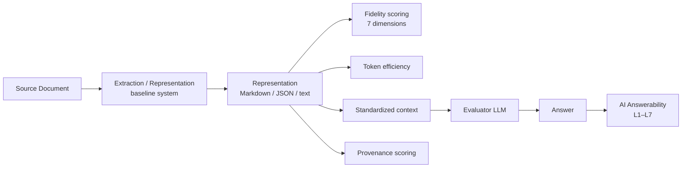
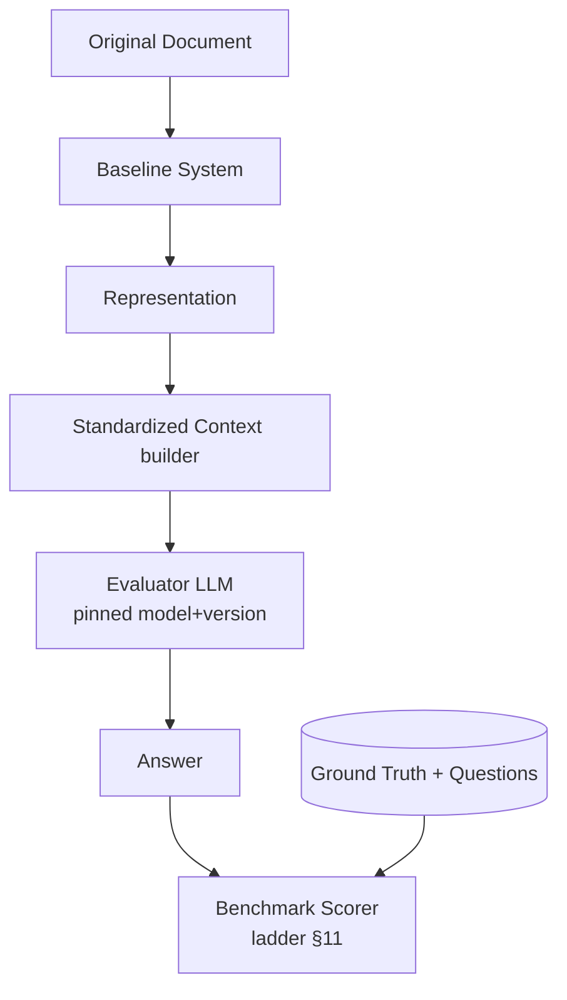
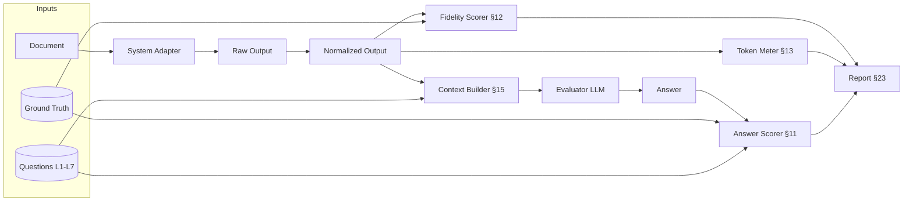

# ContextForge — Benchmark Specification (Milestone 1B-1)

> **Change-control contract.** Milestone 1A
> ([01_document_fidelity_model.md](01_document_fidelity_model.md)) is a **frozen
> baseline**. This document consumes 1A's definitions (seven fidelity
> dimensions, L1–L7 question classes, Semantic Loss Budget, Semantic Document
> Graph, hypotheses H1–H5, evidence labels) **without modifying them**. Any
> tension discovered is recorded in [Section 27](#section-27--reconciliation-with-milestone-1a) rather than
> silently changing 1A.

> **Status contract.** This is **1B-1: Benchmark Specification only**. It is the
> first of five sub-milestones:
>
> | Sub-milestone | Deliverable | State |
> |---|---|---|
> | **1B-1** | Benchmark specification (this document) | **in progress** |
> | 1B-2 | Corpus construction | not started |
> | 1B-3 | Ground-truth annotation | not started |
> | 1B-4 | Question set construction | not started |
> | 1B-5 | Baseline execution | not started |
>
> Completing this specification does **not** mean any corpus, ground truth,
> question set, or measurement exists.

**Label legend**

| Label | Meaning |
|-------|---------|
| `[FACT]` | Established and, for third-party claims, backed by a primary source in [Section 28](#section-28--sources). |
| `[HYP]` | A ContextForge hypothesis inherited from 1A. Believed, not proven. |
| `[OPEN]` | An unresolved design/research question deferred to 1C or later. |
| `PROPOSED` | A candidate metric/weight/threshold with no final commitment. |

---

## Table of contents

1. [Purpose and Primary Question](#section-1--purpose-and-primary-question)
2. [Relationship to Milestone 1A](#section-2--relationship-to-milestone-1a)
3. [Benchmark Design Principles](#section-3--benchmark-design-principles)
4. [Dataset Design](#section-4--dataset-design)
5. [Document Inclusion / Exclusion Policy](#section-5--document-inclusion--exclusion-policy)
6. [Ground Truth Model](#section-6--ground-truth-model)
7. [Ground Truth Levels](#section-7--ground-truth-levels)
8. [Annotation Policy](#section-8--annotation-policy)
9. [Question / Answerability Benchmark](#section-9--question--answerability-benchmark)
10. [L1–L7 Question Methodology](#section-10--l1l7-question-methodology)
11. [Answer Scoring](#section-11--answer-scoring)
12. [Fidelity Metrics (PROPOSED)](#section-12--fidelity-metrics-proposed)
13. [Token Efficiency](#section-13--token-efficiency)
14. [Semantic Loss](#section-14--semantic-loss)
15. [End-to-End AI Evaluation Protocol](#section-15--end-to-end-ai-evaluation-protocol)
16. [Baseline Systems](#section-16--baseline-systems)
17. [Fair Comparison Policy](#section-17--fair-comparison-policy)
18. [Performance Metrics](#section-18--performance-metrics)
19. [Cost Metrics](#section-19--cost-metrics)
20. [Reproducibility](#section-20--reproducibility)
21. [Data Versioning](#section-21--data-versioning)
22. [Benchmark Directory Design](#section-22--benchmark-directory-design)
23. [Reporting Format](#section-23--reporting-format)
24. [Limitations and Threats to Validity](#section-24--limitations-and-threats-to-validity)
25. [Milestone 1B-1 Exit Criteria](#section-25--milestone-1b-1-exit-criteria)
26. [Open Questions for 1C](#section-26--open-questions-for-1c)
27. [Reconciliation with Milestone 1A](#section-27--reconciliation-with-milestone-1a)
28. [Sources](#section-28--sources)

---

## Section 1 — Purpose and Primary Question

**Primary question of Milestone 1B.**

> *Can we build a reproducible evaluation framework that distinguishes ordinary
> document-extraction quality from semantic and AI-context fidelity?*

The benchmark evaluates the full path from a source document to an AI answer:



`[HYP]` (inherited **H1**, 1A §17) Extraction fidelity does **not** guarantee
downstream AI answerability. The benchmark's central job is to make that
difference *measurable* rather than assumed.

**What this benchmark is _not_.** It is not a Markdown-similarity contest, not a
single-number leaderboard, and not (in 1B-1) a producer of any score. It is a
*protocol*: inputs, ground truth, questions, scoring rules, and controls, defined
precisely enough that an independent contributor can execute it and obtain
comparable numbers.

---

## Section 2 — Relationship to Milestone 1A

The benchmark measures the seven fidelity dimensions defined in 1A §3 and the
L1–L7 answerability classes defined in 1A §10. Mapping:

| 1A concept | 1B benchmark realization |
|---|---|
| Content Fidelity (1A §4) | [§12](#section-12--fidelity-metrics-proposed) content metrics; L1 questions |
| Structural Fidelity (1A §5) | [§12](#section-12--fidelity-metrics-proposed) structure metrics; L2 questions |
| Layout / Spatial Fidelity (1A §6) | [§12](#section-12--fidelity-metrics-proposed) reading-order/region metrics; L3 questions |
| Relationship Fidelity (1A §7) | [§6](#section-6--ground-truth-model) relationship edges; [§12](#section-12--fidelity-metrics-proposed) edge P/R/F1; L4 questions |
| Semantic Fidelity (1A §8) | [§12](#section-12--fidelity-metrics-proposed) fact/unit metrics; L5 questions |
| Provenance Fidelity (1A §9) | [§6](#section-6--ground-truth-model) provenance fields; [§12](#section-12--fidelity-metrics-proposed) source-location accuracy; L7 questions |
| AI Answerability (1A §10) | [§9](#section-9--question--answerability-benchmark)–[§11](#section-11--answer-scoring), [§15](#section-15--end-to-end-ai-evaluation-protocol); L1–L7 end-to-end |
| Semantic Loss Budget (1A §11) | [§14](#section-14--semantic-loss) benchmark concept |
| Semantic Document Graph (1A §7) | [§6](#section-6--ground-truth-model) ground-truth graph (benchmark graph, **not** the production IR) |
| Adversarial patterns (1A §13) | [§4](#section-4--dataset-design) corpus categories; per-document difficulty tags |

No 1A definition is altered here. See [§27](#section-27--reconciliation-with-milestone-1a) for the reconciliation note.

---

## Section 3 — Benchmark Design Principles

These principles are **normative** for every future run.

| # | Principle | Rationale |
|---|-----------|-----------|
| P1 | **Same source document** for every system. | Comparing systems on different inputs is invalid. |
| P2 | **Same questions** for every system, per document. | Isolates representation quality from question variance. |
| P3 | **Same evaluator configuration** (model, temperature, prompt, limits) where possible. | Controls evaluator variance. |
| P4 | **Deterministic where possible.** | Deterministic scorers (exact/normalized/TEDS/F1) precede any LLM judge. |
| P5 | **Human annotation only where necessary.** | Cost control; reserve humans for L4–L6 and adjudication. |
| P6 | **Never compare across different source documents.** | Corollary of P1. |
| P7 | **Record version + configuration of every baseline.** | Reproducibility ([§20](#section-20--reproducibility)). |
| P8 | **Store raw outputs, immutable.** | Enables re-scoring without re-running. |
| P9 | **Store normalized outputs separately from raw.** | Normalization is a documented transform, never in place. |
| P10 | **Never modify competitor output before scoring without documenting the transform.** | Auditable fairness ([§17](#section-17--fair-comparison-policy)). |
| P11 | **Separate parser failure from evaluator failure.** | A wrong answer may be the LLM's fault, not the parser's. |
| P12 | **Report uncertainty, never manufacture precision.** | Confidence intervals over point claims ([§23](#section-23--reporting-format)). |
| P13 | **Avoid benchmark leakage.** | Ground truth and questions are not fed to systems under test. |
| P14 | **Keep development vs evaluation splits separate.** | Prevents overfitting ContextForge to the eval set ([§24](#section-24--limitations-and-threats-to-validity)). |
| P15 | **Reproducible by another contributor.** | A Benchmark Run ID reconstructs everything ([§20](#section-20--reproducibility)). |

---

## Section 4 — Dataset Design

**Target for v0.1: ~30 difficult documents.** The corpus is deliberately biased
toward structural difficulty — an easy-PDF-dominated corpus cannot discriminate
the dimensions in 1A. **No documents are collected in 1B-1** (collection is
1B-2). This section defines *what* to collect and *why*.

### 4.1 Categories

| # | Category | Target count | Primarily stresses (1A dims) | Failures it is meant to expose |
|---|----------|:---:|---|---|
| C1 | Financial annual reports | 5 | Content, Structure, Relationship, Semantic, Provenance | multi-page tables, totals, footnote→value links, %-vs-pp |
| C2 | Research papers | 4 | Layout, Structure, Relationship | two-column reading order, figure↔caption, cross-references |
| C3 | Legal / contracts | 3 | Structure, Semantic, Provenance | nested clause numbering, defined-term references, cross-refs |
| C4 | Technical documents / manuals | 3 | Structure, Layout, Relationship | mixed layouts, diagrams, callouts, step lists |
| C5 | Investor presentations (slides) | 4 | Layout, Relationship, Semantic | chart↔underlying data, sparse text, spatial grouping |
| C6 | Invoices / financial statements | 3 | Content, Structure, Semantic | merged cells, totals, negative/accounting signs |
| C7 | Scanned documents | 4 | Content (OCR), Layout, Provenance | OCR noise, skew, no text layer |
| C8 | Mixed-layout / adversarial | 4 | All (targeted) | direct instantiations of 1A §13 patterns |
| — | **Total** | **~30** | — | — |

Counts are `PROPOSED` and may shift in 1B-2 provided the diversity requirements
(§4.2) still hold; any change is recorded in the corpus manifest ([§21](#section-21--data-versioning)).

### 4.2 Diversity requirements

The corpus MUST, in aggregate, satisfy minimum coverage so results are not an
artifact of one easy distribution:

| Axis | Minimum coverage requirement |
|------|------------------------------|
| Page count | ≥6 documents >20 pages; ≥3 single-page |
| Native vs scanned | ≥4 scanned (C7); rest native/born-digital |
| Language | ≥2 non-English documents (`[OPEN]` which languages) |
| Tables | ≥12 documents contain non-trivial tables |
| Multi-page tables | ≥4 documents contain a table spanning pages |
| Merged / nested headers | ≥4 documents |
| Charts | ≥6 documents contain charts with an underlying data relationship |
| Multi-column | ≥5 documents |
| Footnotes | ≥4 documents |
| Captions | ≥6 documents |
| Mixed orientation | ≥2 documents (landscape table in portrait doc) |
| Cross-page references | ≥4 documents |

### 4.3 Adversarial mapping

Each 1A §13 adversarial pattern MUST be instantiated by ≥1 document, tagged with
its pattern ID, so every pattern has at least one test bed. Coverage is tracked
in the corpus manifest and is an exit criterion for 1B-2 (not 1B-1).

---

## Section 5 — Document Inclusion / Exclusion Policy

Objective rules so selection is not cherry-picking ([§24](#section-24--limitations-and-threats-to-validity)).

### 5.1 Inclusion (a document qualifies if it has ≥2 difficulty factors)

Complex tables · merged cells · multiple columns · charts · figures · footnotes ·
repeated headers/footers · cross-references · multi-page tables · dense financial
data · scanned content · diagrams · mixed page orientation.

### 5.2 Exclusion

- Trivial one-page text-only documents with **no** structural complexity.
- Documents with no meaningful structure beyond linear prose.
- Duplicates or near-duplicates of an already-selected document.
- Documents whose ground truth cannot be reasonably annotated (irreducibly
  ambiguous even to expert annotators).
- Documents whose license/distribution forbids benchmark redistribution (§5.3).

### 5.3 Licensing and redistribution

`[FACT]` Redistribution rights vary by document. To keep the benchmark itself
freely shareable:

- **Prefer** public-domain, government, or openly-licensed (e.g., CC-BY) sources.
- If a document cannot be redistributed, store **only** a reference (URL + hash +
  retrieval date) and the derived ground truth/questions, **not** the file.
- Raw document files are **git-ignored** ([§22](#section-22--benchmark-directory-design)); only metadata, ground truth,
  and questions are version-controlled.
- No copyrighted or sensitive/PII documents enter the committed corpus. `[OPEN]`
  whether a small redistributable "public core" plus a "reference-only extended
  set" is the right structure.

---

## Section 6 — Ground Truth Model

Ground truth is the **reference answer key** the benchmark scores against. It is
a structured representation of what the document actually contains.

> **Boundary.** This is **benchmark ground truth**, deliberately **not** the
> production ContextForge IR. It intentionally over-annotates (bounding boxes,
> every relationship) so scoring is possible; the production IR (a later
> milestone) may be leaner. Freezing the IR here would violate 1A's guardrail
> against premature architecture lock-in (1A §15).

### 6.1 Node types

`Document · Page · Block · Heading · Paragraph · List · ListItem · Table ·
TableCell · Figure · Chart · Caption · Footnote · Formula · Fact · Relationship`

### 6.2 Common annotation fields

Every annotated node carries:

| Field | Meaning |
|-------|---------|
| `id` | Stable unique ID (e.g., `d03/p2/tbl1/r4/c2`). |
| `type` | One of the node types in §6.1. |
| `normalized_content` | Canonical text/value (normalization rules per [§11.2](#section-11--answer-scoring)). |
| `raw_content` | As-extracted string, before normalization. |
| `page` | 1-based page index. |
| `bbox` | `[x0,y0,x1,y1]` in a declared coordinate space, where practical. |
| `source_order` | Reading-order rank assigned by annotators. |
| `relationships` | List of typed edges (§6.3). |
| `annotation_status` | `draft · single · double · adjudicated`. |
| `confidence` | Annotator confidence `high · medium · low`. |
| `notes` | Free text (ambiguity, rationale). |

### 6.3 Relationship (edge) schema

Edges reuse the 1A §7 conceptual vocabulary (**not** frozen):

`contains · follows · references · explains · illustrates · derived_from ·
continues · annotates · cites`

Each edge: `{ id, type, source_id, target_id, confidence, annotation_status, notes }`.

Example (chart derived from a table, explained by a paragraph):

```json
{ "id": "d05/rel/17", "type": "derived_from",
  "source_id": "d05/p3/chart1", "target_id": "d05/p3/tbl2",
  "confidence": "high", "annotation_status": "double", "notes": "bar heights match FY24 column" }
```

### 6.4 Fact nodes (semantic layer)

A `Fact` captures a semantic tuple the document asserts, so L5/L6 questions can be
graded against structured truth rather than prose:

```json
{ "id": "d01/fact/12", "type": "Fact",
  "subject": "Revenue", "period": "FY2025", "value": 12.4, "unit": "USD_bn",
  "sign": "positive", "qualifier": null,
  "provenance": ["d01/p7/tbl1/r3/c4"], "confidence": "high" }
```

`[FACT]` Distinguishing `20%` from `20 percentage points`, and accounting
negatives, is a required semantic distinction from 1A §8; `Fact.unit`,
`Fact.sign`, and `Fact.qualifier` exist to encode it.

---

## Section 7 — Ground Truth Levels

Three annotation levels of increasing cost and subjectivity.

| Level | Name | Contents | Validation | Cost |
|:---:|------|----------|-----------|:---:|
| **L1-GT** | Content | text, numbers, formulas per block (`normalized_content`) | mostly **auto-checkable** (string/number normalization) | low |
| **L2-GT** | Structural / layout | node types, hierarchy, `source_order`, bboxes, page furniture | **semi-auto** (schema/consistency checks) + human spot-check | medium |
| **L3-GT** | Semantic / relational | `Fact` nodes, typed relationships, cross-references | **human-verified** (double annotation + adjudication) | high |

`[FACT]` Level correlates with automatability: content is largely deterministic;
relationships and semantics require human judgment and inter-annotator agreement
([§8](#section-8--annotation-policy)). A benchmark run may score only the levels for which ground truth
exists; missing levels are reported as *not scored*, never as zero.

---

## Section 8 — Annotation Policy

Deliberately lightweight — practical for a solo/small open-source effort.

- **Who annotates.** Project maintainers and vetted contributors following the
  annotation guidelines (a future `benchmarks/ground_truth/GUIDELINES.md`, 1B-3).
- **Single vs double annotation.**
  - L1-GT / L2-GT: **single** annotation + automated consistency checks.
  - L3-GT (facts, relationships): **double** annotation on a defined subset.
- **Disagreement handling.** Divergences are logged; a third annotator or
  maintainer **adjudicates**; the adjudicated value sets `annotation_status:
  adjudicated`.
- **Inter-annotator agreement (IAA).** Report agreement on the double-annotated
  subset: `[FACT]` Cohen's/Fleiss' κ for categorical labels (node type, edge
  type); exact/normalized match rate for values; edge-set F1 for relationships.
  Low IAA on a category is a signal the category is ill-defined — recorded, not
  hidden ([§24](#section-24--limitations-and-threats-to-validity)).
- **Confidence.** Every node/edge carries `confidence`; low-confidence items may
  be excluded from headline metrics and reported separately.
- **Versioning.** Ground truth is versioned (`groundtruth-vX.Y`, [§21](#section-21--data-versioning)); schema
  changes bump the version and can invalidate prior comparisons.
- **Non-goal (1B-1).** No annotation tooling is built and no document is
  annotated here. This is policy only.

---

## Section 9 — Question / Answerability Benchmark

Answerability uses the **L1–L7 classes from 1A §10**, unchanged. A benchmark
question is scored on whether an evaluator LLM, given **only** a system's
representation, produces the correct answer.

### 9.1 Question schema (`PROPOSED`)

```json
{
  "id": "d01/q/007",
  "document_id": "d01",
  "level": "L5",
  "question": "What drove the EBITDA margin improvement in FY2025?",
  "expected_answer": "Lower input costs and an improved product mix.",
  "acceptable_answers": ["reduced raw-material costs and better mix", "..."],
  "unanswerable": false,
  "required_evidence": ["d01/p12/para3", "d01/p11/tbl2"],
  "source_nodes": ["d01/p12/para3"],
  "fidelity_dimensions": ["semantic", "relationship"],
  "difficulty": "hard",
  "scoring_method": "llm_judge_with_rubric+human_audit"
}
```

The exact JSON is not frozen. **Required** conceptual fields: `id`,
`document_id`, `level`, `question`, `expected_answer`, `acceptable_answers`,
`required_evidence`/`source_nodes`, `fidelity_dimensions`, `difficulty`,
`scoring_method`, and an `unanswerable` flag.

### 9.2 Unanswerable and trap questions

`[FACT]` Following DocVQA-style purpose-driven QA and to detect hallucination,
each document SHOULD include ≥1 **unanswerable** question (the answer is *not*
present). A system/evaluator that fabricates an answer is scored **Hallucinated**
([§11](#section-11--answer-scoring)). This directly tests 1A hypothesis **H4** (provenance/verifiability).

### 9.3 Leakage control

`[FACT]` Ground-truth `source_nodes`, `required_evidence`, and `expected_answer`
are **never** provided to the system under test or placed in the evaluator's
context alongside the system output. Only the system's own representation reaches
the evaluator (P13).

---

## Section 10 — L1–L7 Question Methodology

For each class: objective, what is correct, common failure, scoring strategy.
Question counts per class are `PROPOSED` and balanced so no single class
dominates.

### L1 — Direct extraction
- **Example.** "What was revenue in 2025?"
- **Objective.** Is a directly stated value/text present and correct?
- **Correct.** Normalized value matches ground truth (number/unit/sign).
- **Common failure.** OCR/number corruption; wrong cell picked from a table.
- **Scoring.** Deterministic: normalized exact match / numeric tolerance ([§11](#section-11--answer-scoring)).

### L2 — Structural
- **Example.** "Which section discusses revenue growth?"
- **Objective.** Is document hierarchy preserved and navigable?
- **Correct.** Correct section/heading identified.
- **Common failure.** Flattened headings; lost section membership.
- **Scoring.** Normalized match against heading IDs; rule-based.

### L3 — Spatial
- **Example.** "What figure appears immediately below the revenue table?"
- **Objective.** Is reading order / spatial adjacency preserved?
- **Correct.** Correct adjacent element by ground-truth `source_order`/bbox.
- **Common failure.** Column interleaving; wrong reading order.
- **Scoring.** Rule-based against `source_order`/bbox adjacency.

### L4 — Relational
- **Example.** "Which chart corresponds to Table 4?"
- **Objective.** Are inter-element relationships (1A §7) recoverable?
- **Correct.** Correct `derived_from`/`illustrates` target.
- **Common failure.** Chart and table extracted but link lost.
- **Scoring.** Match against ground-truth edges; may need human audit.

### L5 — Semantic
- **Example.** "What caused the EBITDA margin improvement?"
- **Objective.** Is meaning (causation, units, signs) preserved, not just text?
- **Correct.** Answer consistent with `Fact` nodes and semantics (§6.4).
- **Common failure.** `%` vs `pp` confusion; sign errors; unit drift.
- **Scoring.** Rubric + LLM judge with human audit ([§11](#section-11--answer-scoring)).

### L6 — Cross-element reasoning
- **Example.** "Using the table and the accompanying paragraph, why did Region A
  grow faster?"
- **Objective.** Can the representation support reasoning across ≥2 elements?
- **Correct.** Answer requires and correctly combines both elements.
- **Common failure.** One element missing → plausible but wrong answer.
- **Scoring.** Rubric + LLM judge + mandatory human audit; check both
  `required_evidence` elements are actually present in the representation.

### L7 — Provenance
- **Example.** "Where in the original document did this value originate?"
- **Objective.** Can the answer be traced to a source location (1A §9)?
- **Correct.** Correct page and (where practical) block/table/cell.
- **Common failure.** No provenance emitted; page-off-by-one.
- **Scoring.** `[FACT]` Page-level provenance accuracy (analogous to MP-DocVQA
  answer-page prediction) plus, where the representation supports it,
  block/cell-level match.

---

## Section 11 — Answer Scoring

### 11.1 Answer categories

Every answer is assigned exactly one:

| Category | Determined when |
|----------|-----------------|
| **Correct** | Matches ground truth under the class's scoring method. |
| **Partially correct** | Right entity/direction but incomplete or missing a required part. |
| **Incorrect** | Wrong value/entity, but grounded in the representation. |
| **Unsupported** | Answer not derivable from the representation (should have abstained). |
| **Hallucinated** | Fabricated content, especially on `unanswerable` questions. |

### 11.2 Scoring-method ladder (prefer the most deterministic that applies)

| Rung | Method | Used for | Notes |
|:---:|--------|----------|-------|
| 1 | **Exact match** | canonical IDs, enumerated answers | strictest |
| 2 | **Normalized match** | text/values | Unicode NFC, whitespace collapse, case, thousands separators, currency/percent normalization |
| 3 | **Numeric tolerance** | numbers | value + unit + sign; tolerance band declared per question (`[OPEN]` default band) |
| 4 | **Rule-based** | structure/spatial/provenance (L2/L3/L7) | operate on IDs/`source_order`/bbox |
| 5 | **String-similarity** | short free-text (L1/L2) | `[FACT]` ANLS (Average Normalized Levenshtein Similarity), the DocVQA metric, for OCR-tolerant text |
| 6 | **LLM-as-judge + rubric** | semantic/relational (L4–L6) | only when 1–5 cannot decide; safeguards §11.4 |
| 7 | **Human evaluation** | adjudication, audits, L6 | final authority |

### 11.3 Separate metric families

Report these **separately**, never collapsed prematurely:

1. **Factual correctness** — is the value/entity right?
2. **Completeness** — are all required parts present?
3. **Source grounding** — is the answer supported by the representation (not the
   model's prior)? `[FACT]` Operationalized via claim-decomposition faithfulness
   (RAGAS-style: split answer into claims, check each against the representation).
4. **Relationship correctness** — L4/L6 edge use.
5. **Provenance correctness** — L7 location accuracy.

### 11.4 LLM-as-judge safeguards

`[FACT]` LLM judges are known to be biased and non-deterministic; they are used
only as rung 6, never as sole authority for headline claims. Safeguards:

- Judge sees the **rubric + ground-truth answer + system answer**, but the
  ground truth is **not** exposed to the system under test (P13).
- Fixed judge model + version + temperature 0 + fixed prompt, all recorded.
- **Human audit** of a random sample (`PROPOSED` ≥20% of L5/L6; 100% of
  disagreements and all `unanswerable` items).
- Report **judge–human agreement** as a validity indicator ([§24](#section-24--limitations-and-threats-to-validity)).
- Consider ≥2 judge models; disagreement flags an item for human review.
- Position/verbosity-bias mitigation (randomize answer order; length-controlled
  rubric).

---

## Section 12 — Fidelity Metrics (PROPOSED)

Candidate per-dimension metrics. **All `PROPOSED`; no final weights** (weighting
deferred, see [§12.8](#section-12--fidelity-metrics-proposed) and 1A §12).

### 12.1 Content
- Character/token accuracy vs `normalized_content` (CER/WER-style).
- **Numeric accuracy**: value+unit+sign match rate.
- Extraction precision/recall/F1 over content blocks.

### 12.2 Structure
- Block-type classification accuracy (node type vs ground truth).
- Hierarchy accuracy (correct parent/section membership; tree edit distance).
- Page-furniture detection (headers/footers correctly identified/suppressed).

### 12.3 Layout / Spatial
- **Reading-order accuracy** (rank correlation vs `source_order`, e.g., Kendall's τ).
- Region-association accuracy (blocks assigned to correct column/region).

### 12.4 Relationships
- Edge **precision / recall / F1** vs ground-truth edges, per edge type.
- Cross-reference resolution rate.

### 12.5 Semantics
- `Fact` accuracy (subject/period/value/unit/sign tuple match).
- Unit correctness; metric–value association accuracy.
- `%` vs `pp` disambiguation rate (targeted).

### 12.6 Provenance
- Source-location accuracy (page; block/cell where supported).
- Citation-resolution accuracy (does a cited node exist and match?).

### 12.7 AI Answerability
- Per-class accuracy (L1–L7), completeness, groundedness/faithfulness ([§11.3](#section-11--answer-scoring)).
- Hallucination rate on `unanswerable` questions.

### 12.8 Table structure (cross-cutting)
`[FACT]` For table structure specifically, use **TEDS** (Tree-Edit-Distance-based
Similarity), the standard table-structure metric, in addition to cell-content
accuracy.

### 12.9 Aggregation stance
The benchmark reports a **fidelity vector** (one score per dimension) plus the
answerability profile. `[HYP]` Whether a single scalar "Document Fidelity Score"
is meaningful is unresolved (1A §12); if reported, it is `PROPOSED / NOT FINAL`,
with per-document-class weighting justified empirically in 1C, and always shown
with the underlying vector.

---

## Section 13 — Token Efficiency

`[FACT]` Token counts are tokenizer-dependent and not comparable across
tokenizers without disclosure.

### 13.1 Standard evaluator tokenizer
The benchmark declares **one standard tokenizer** for all cross-system token
comparisons (`[OPEN]` which one; it must be pinned by version). Systems may
internally use other tokenizers, but **all reported** token counts are computed
with the standard tokenizer applied uniformly to each system's output.

### 13.2 Measured quantities
- Source representation token count (baseline reference).
- Normalized-text token count.
- Markdown-output token count.
- JSON-output token count.
- Final AI-context token count (what actually reaches the evaluator).
- **Compression ratio** = output tokens / source-reference tokens.

### 13.3 Token vs semantic compression
`[HYP]` **Token compression** (fewer tokens) must be distinguished from
**semantic compression** (fewer tokens *without* losing needed information). A
system can trivially reduce tokens by deleting content; the benchmark must not
reward that. Therefore **token efficiency is never scored alone** — it is
interpreted jointly with answerability and fidelity ([§14](#section-14--semantic-loss)).

---

## Section 14 — Semantic Loss

### 14.1 The core anti-gaming rule
> **An efficiency score is only valid when paired with the fidelity and
> answerability scores of the *same* representation.** A representation that is
> smaller but answers fewer questions has *not* improved efficiency in the sense
> ContextForge cares about.

### 14.2 Semantic Loss Budget (benchmark concept)
`[HYP]` (inherited from 1A §11) The **Semantic Loss Budget** reframes the target
as *maximum useful semantic information under a token budget*, not *minimum
tokens*. As a **benchmark/evaluation concept** (not an implementation algorithm),
it is realized by reporting, for a given token budget:

- answerability retained (L1–L7 accuracy at that budget), and
- fidelity retained (the §12 vector at that budget).

`[OPEN]` No final mathematical formula for a single "loss" number is adopted here;
inventing one now would be premature (P12, 1A §12). Candidate framings (e.g.,
answerability-per-token curves; Pareto fronts of fidelity vs tokens) are for 1C.

### 14.3 What over-compression looks like
Redundant headers, duplicate sections, and repeated page furniture are *safe* to
drop (they raise efficiency without losing facts). Dropping footnote→value links,
chart→table relationships, units, or signs is *unsafe* — it lowers answerability.
The benchmark's job is to tell these apart empirically.

---

## Section 15 — End-to-End AI Evaluation Protocol



### 15.1 Controls (identical across systems)
Same evaluator model + version · same temperature (0 where supported) · same
system prompt · same question text · same **context policy** (how the
representation is placed in context; if truncation is needed, the policy is fixed
and disclosed) · same max output tokens · same retry policy · same scorer version.

### 15.2 Confounders and mitigations
| Confounder | Mitigation |
|-----------|-----------|
| Model non-determinism | temperature 0; fixed seeds where available; repeat N times and report variance |
| Evaluator/judge bias | rung-6 safeguards ([§11.4](#section-11--answer-scoring)); ≥2 judges; human audit |
| Prompt sensitivity | fixed, published prompts; prompt is part of the versioned scorer |
| Context-window differences | fixed context policy; log truncation events per document/system |
| Cost / latency | measured ([§18](#section-18--performance-metrics)–[§19](#section-19--cost-metrics)); not mixed into fidelity/answerability scores |

### 15.3 Parser-failure vs evaluator-failure (P11)
When an answer is wrong, the scorer records whether the required evidence was
**present in the representation**. If absent → representation/parser failure. If
present but the LLM still failed → evaluator failure. These are reported
separately; they are different phenomena.

---

## Section 16 — Baseline Systems

Systems eventually evaluated (execution is **1B-5**, not now):

| # | System | Role in 1B |
|---|--------|-----------|
| 1 | Firecrawl (incl. `/parse`, pdf-inspector) | baseline |
| 2 | Docling | baseline |
| 3 | MarkItDown | baseline |
| 4 | PyMuPDF / PyMuPDF4LLM | baseline |
| 5 | **ContextForge** | **NOT IMPLEMENTED YET** — the harness must support a future adapter without special-casing |

### 16.1 Per-system record (mandatory for every run)
version · commit/release hash · exact command/configuration · OS · runtime
(language/interpreter versions) · OCR enabled/disabled + engine/version · any
model dependencies (name+version) · output format(s) · preprocessing applied ·
postprocessing applied · execution time · peak memory (if measured).

### 16.2 Adapter contract
Each baseline is wrapped by an **adapter** that takes a document path + fixed
config and returns `{ raw_output, output_format, logs, timing }`. Adapters
perform **no** undocumented transformation (P10). ContextForge's adapter is a
stub in 1B-1 (spec only, no code).

---

## Section 17 — Fair Comparison Policy

Rigorous, because most invalid benchmarks fail here.

- **Identical inputs** (P1/P6): byte-identical document files, verified by hash.
- **Documented configuration**: every non-default flag recorded (§16.1).
- **No hidden postprocessing** (P10): raw output stored immutably (P8);
  normalization stored separately (P9) with the transform code/version.
- **Preprocessing disclosure**: any pre-conversion (e.g., rasterization,
  OCR-on/off) is logged per system.
- **Tokenizer disclosure**: standard tokenizer pinned ([§13.1](#section-13--token-efficiency)).
- **Evaluator disclosure**: model+version+prompt+scorer version recorded.
- **Version pinning + environment capture** ([§20](#section-20--reproducibility)).

### 17.1 Capability-mismatch handling
When one system supports a feature another does not, **do not silently drop the
hard document.** Instead classify the outcome per (system, document, question):

| Status | Meaning |
|--------|---------|
| **Supported** | System produced a usable representation for this item. |
| **Unsupported** | System does not support this input/feature (e.g., no OCR). |
| **Failed** | System errored/crashed/timed out. |
| **Partial** | Produced output but incomplete for this item. |

Aggregate metrics are always reported **with** the Supported/Unsupported/
Failed/Partial breakdown, so no system is flattered by silent exclusions.

---

## Section 18 — Performance Metrics

Optional but recorded when feasible. **Parsing latency and AI-evaluation latency
are reported separately and never summed.**

| Group | Metrics |
|-------|---------|
| Parsing | total processing time; pages/sec; documents/sec; peak memory; CPU; cold-start vs warm latency |
| AI evaluation | evaluator latency per question; retries; truncation events |

Performance never contributes to fidelity or answerability scores; it is context
for interpreting cost/practicality.

---

## Section 19 — Cost Metrics

Definitions only; **no numbers are produced in 1B-1.**

- Compute cost (local CPU/GPU time).
- API cost (per-system, if a system calls a paid API).
- LLM evaluation cost (judge + answerer tokens × price).
- Storage (raw outputs, artifacts).

Costs are reported alongside, never blended into, quality metrics.

---

## Section 20 — Reproducibility

To reproduce a result, another contributor needs: exact document version/hash ·
baseline version/hash · full configuration · OS · runtime versions · standard
tokenizer version · evaluator model+version · exact prompts · benchmark spec
version · scorer version.

### 20.1 Benchmark Run ID
Every execution is stamped with a **Benchmark Run ID**, e.g. `BMR-2026-001`,
which indexes an immutable **run manifest** capturing all of the above plus
artifact hashes. Given a Run ID, the run is reconstructable (modulo external
API/model drift, which the manifest records so drift is at least visible).

---

## Section 21 — Data Versioning

Independently versioned, because a change to any one can invalidate prior
comparisons:

| Artifact | Version tag | Example |
|----------|-------------|---------|
| Benchmark spec | `benchmark-vX.Y` | `benchmark-v0.1` |
| Corpus | `corpus-vX.Y` | `corpus-v0.1` |
| Ground truth | `groundtruth-vX.Y` | `groundtruth-v0.1` |
| Question set | `questions-vX.Y` | `questions-v0.1` |
| Scorer | `scorer-vX.Y` | `scorer-v0.1` |

`[FACT]` Changing the corpus, ground truth, questions, or scorer means results
are **not** comparable to results from a prior version. A run manifest ([§20](#section-20--reproducibility))
pins every version so comparability is explicit, never assumed.

---

## Section 22 — Benchmark Directory Design

Proposed structure. **Only lightweight placeholders are created in 1B-1** — no
corpus, no large binaries.

```
benchmarks/
├── README.md            # overview + pointer to this spec
├── spec/                # normative machine-readable excerpts (later)
├── schemas/             # JSON schema placeholders (ground truth, question, run manifest, result)
├── corpus/              # corpus MANIFEST (metadata only; raw files git-ignored)
├── ground_truth/        # ground-truth annotations, versioned (1B-3)
├── questions/           # question sets, versioned (1B-4)
├── baselines/           # per-system adapter specs + pinned configs (no code yet)
├── runs/                # run manifests + raw outputs (raw outputs git-ignored)
└── results/             # scored results + generated reports
```

`[FACT]` Raw documents and raw system outputs are **git-ignored** ([§5.3](#section-5--document-inclusion--exclusion-policy)); only
metadata, schemas, ground truth, questions, and reports are version-controlled.
Directory READMEs act as placeholders so the structure exists in git without
committing any data.

---

## Section 23 — Reporting Format

A future benchmark report (produced no earlier than 1B-5 / 1C) SHOULD contain:

1. **Executive Summary** — what was tested; no superiority claim without CIs.
2. **Environment** — Run ID, OS, runtimes, model/tokenizer versions.
3. **Dataset** — corpus version, category/diversity coverage.
4. **Systems** — versions, configs, adapter notes.
5. **Fidelity Results** — the §12 vector, per dimension, per document class.
6. **AI Answerability** — L1–L7 profiles; hallucination rate; parser-vs-evaluator
   failure split.
7. **Token Efficiency** — under the standard tokenizer; compression ratios.
8. **Performance** — parsing vs evaluation latency (separate).
9. **Failure Analysis** — Supported/Unsupported/Failed/Partial breakdown.
10. **Statistical Uncertainty** — confidence intervals; variance across repeats;
    judge–human agreement.
11. **Limitations** — carried from [§24](#section-24--limitations-and-threats-to-validity).
12. **Reproducibility Information** — full manifest reference.

---

## Section 24 — Limitations and Threats to Validity

Mandatory. Each risk plus its mitigation.

| Threat | Risk | Mitigation |
|--------|------|-----------|
| **Small benchmark (~30 docs)** | wide CIs; limited generality | report CIs (P12); treat v0.1 as pilot; grow in later versions |
| **Domain bias** | finance/research over-weighted | enforce category + diversity minimums ([§4](#section-4--dataset-design)) |
| **Annotation bias** | annotators encode assumptions | double annotation + IAA + adjudication ([§8](#section-8--annotation-policy)) |
| **Evaluator-model bias** | one LLM's quirks dominate | fixed config; consider ≥2 answerer models (`[OPEN]`) |
| **LLM-judge bias** | unreliable semantic grading | judge only as rung 6; human audit; judge–human agreement reported ([§11.4](#section-11--answer-scoring)) |
| **Tokenizer bias** | unfair token comparisons | single pinned standard tokenizer ([§13.1](#section-13--token-efficiency)) |
| **Licensing limits** | corpus not shareable | reference-only for non-redistributable docs ([§5.3](#section-5--document-inclusion--exclusion-policy)) |
| **Cherry-picking** | selecting docs that flatter a system | objective inclusion/exclusion ([§5](#section-5--document-inclusion--exclusion-policy)); no silent drops ([§17.1](#section-17--fair-comparison-policy)) |
| **Overfitting ContextForge to the benchmark** | inflated future numbers | dev/eval split (P14); hold-out set; ContextForge not tuned on eval GT |
| **Benchmark contamination** | docs/GT in a model's training data | prefer obscure/recent/openly-tracked docs; record retrieval dates; `[OPEN]` contamination test |
| **Model version drift** | results change over time | pin model+version in manifest; re-runs get new Run IDs |
| **OCR differences** | scanned-doc results reflect OCR, not parser | log OCR engine/version; report scanned separately |
| **Preprocessing differences** | hidden advantages | full preprocessing disclosure ([§17](#section-17--fair-comparison-policy)) |

---

## Section 25 — Milestone 1B-1 Exit Criteria

1B-1 (this specification) is complete when **all** are true:

- [x] Dataset categories defined ([§4](#section-4--dataset-design))
- [x] Inclusion/exclusion policy defined ([§5](#section-5--document-inclusion--exclusion-policy))
- [x] Ground-truth model defined ([§6](#section-6--ground-truth-model))
- [x] Ground-truth levels defined ([§7](#section-7--ground-truth-levels))
- [x] Annotation policy defined ([§8](#section-8--annotation-policy))
- [x] L1–L7 question schema defined ([§9](#section-9--question--answerability-benchmark)–[§10](#section-10--l1l7-question-methodology))
- [x] Answer scoring defined ([§11](#section-11--answer-scoring))
- [x] Fidelity metrics defined (PROPOSED) ([§12](#section-12--fidelity-metrics-proposed))
- [x] Token measurement defined ([§13](#section-13--token-efficiency))
- [x] Semantic-loss concept defined ([§14](#section-14--semantic-loss))
- [x] AI evaluation protocol defined ([§15](#section-15--end-to-end-ai-evaluation-protocol))
- [x] Baseline execution requirements defined ([§16](#section-16--baseline-systems))
- [x] Fair-comparison rules defined ([§17](#section-17--fair-comparison-policy))
- [x] Reproducibility requirements defined ([§20](#section-20--reproducibility))
- [x] Data/versioning policy defined ([§21](#section-21--data-versioning))
- [x] Benchmark directory structure defined ([§22](#section-22--benchmark-directory-design))
- [x] Threats to validity documented ([§24](#section-24--limitations-and-threats-to-validity))

> **Reminder.** Completion of the **specification** does **not** mean the corpus
> has been collected, annotated, or measured. Those are 1B-2 … 1B-5.

---

## Section 26 — Open Questions for 1C

Deferred until competitor execution provides evidence:

1. Which fidelity dimensions actually show meaningful separation between systems?
2. Which failures are reproducible across runs and models?
3. Which metrics correlate with downstream AI answerability (validating **H5**)?
4. How much token compression is realistically achievable without lowering
   answerability (bearing on **H3**)?
5. Is AI answerability actually more discriminative than extraction accuracy
   (the core test of **H1**)?
6. Which document categories should become the primary target?
7. Does the Semantic Document Graph provide *measurable* value (**H2**), or is it
   only conceptually appealing?
8. Should answerability be measured with one LLM or an ensemble?
9. What numeric tolerance bands and ANLS thresholds are appropriate per class?
10. Is a single aggregate Document Fidelity scalar defensible, or should the
    vector always stand alone?

---

## Section 27 — Reconciliation with Milestone 1A

No contradiction with 1A was found; 1A remains unchanged. Two clarifications
worth recording (neither modifies 1A):

1. **Benchmark ground-truth graph vs production IR.** 1A §7 introduces the
   Semantic Document Graph as a *conceptual* model and explicitly declines to
   freeze a schema. This spec's ground-truth graph ([§6](#section-6--ground-truth-model)) is a **benchmark
   artifact** used only for scoring; it is intentionally richer than any eventual
   production IR and does **not** freeze 1A's model. Consistent with 1A §15.
2. **"Score" terminology.** 1A §12 proposes a Document Fidelity Score but assigns
   no weights. This spec keeps that stance: it reports a **fidelity vector** and
   treats any scalar as `PROPOSED / NOT FINAL` ([§12.9](#section-12--fidelity-metrics-proposed)). No weighting is
   introduced here.

If a genuine contradiction is later found, the procedure is: **stop, document,
report** — never silently edit 1A.

---

## Section 28 — Sources

Primary/authoritative sources consulted for evaluation methodology (accessed
2026-08). Cited to ground `[FACT]` methodology claims; **no** performance numbers
are taken from them.

| # | Source | Used for |
|---|--------|----------|
| S1 | DocVQA — docvqa.org; Mathew et al., *DocVQA: A Dataset for VQA on Document Images*, WACV 2021 (arXiv:2007.00398) | purpose-driven document QA; **ANLS** answer metric |
| S2 | Robust Reading Competition — DocVQA challenge (rrc.cvc.uab.es, ch=17); Tito et al., *Multipage DocVQA* (arXiv:2212.05935) | multipage QA; **answer-page prediction** as provenance analogue |
| S3 | RAGAS documentation — Faithfulness metric (docs.ragas.io) | claim-decomposition **faithfulness / groundedness** scoring |
| S4 | Docling Technical Report (arXiv:2408.09869); DocLayNet; TableFormer | layout/table-structure ground-truth practice; **TEDS** context |
| S5 | Awesome Document Understanding (github.com/tstanislawek/awesome-document-understanding) | survey of DU benchmarks, layout analysis, KIE, annotation tooling |

> **Note.** ANLS, TEDS, Cohen's/Fleiss' κ, and claim-decomposition faithfulness
> are established, published evaluation techniques; ContextForge adopts them as
> building blocks rather than inventing new metrics where standards exist.

---

### Appendix A — Evaluation pipeline (reference)



### Appendix B — Traceability note

Every future benchmark artifact (schemas, corpus manifest, annotation
guidelines, scorer implementation) must cite the section of this document it
derives from, and this document cites 1A. A decision with no basis in 1A or this
spec is a signal to revise the spec — not to proceed silently.
